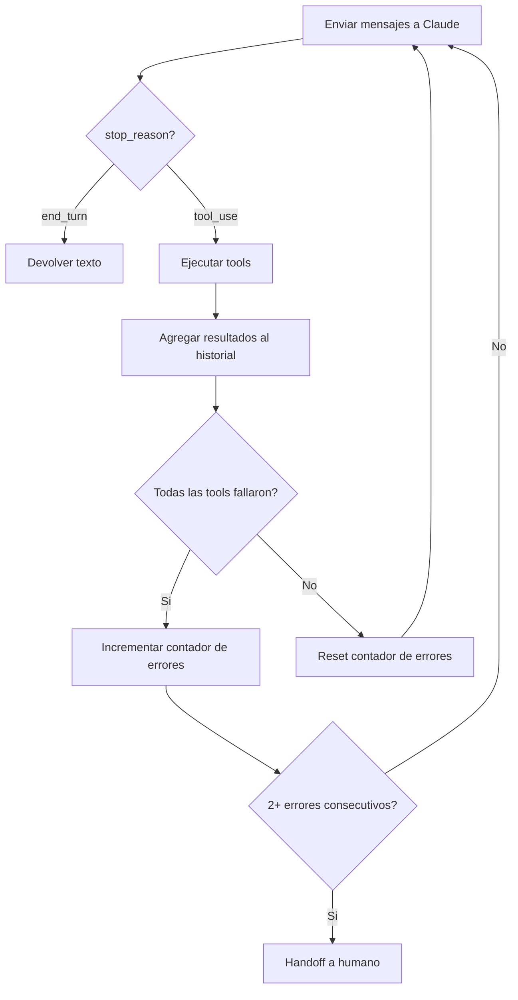

# Integracion con Anthropic (Claude API)

## Vision general

AgendAI usa la API de mensajes de Anthropic con **tool calling nativo**. Claude recibe el historial de conversacion, un system prompt con instrucciones de comportamiento, y una lista de tools que puede invocar. Claude decide cuando llamar una tool, con que parametros, y el backend ejecuta la operacion y devuelve el resultado.

**Archivo principal:** `app/Services/AnthropicService.php`

## Configuracion

```php
// config/services.php
'anthropic' => [
    'key'   => env('ANTHROPIC_API_KEY'),                    // sk-ant-xxxxx
    'model' => env('ANTHROPIC_MODEL', 'claude-sonnet-4-20250514'),
],
```

La API se llama directamente por HTTP (sin SDK):

```
POST https://api.anthropic.com/v1/messages
Headers:
  x-api-key: {ANTHROPIC_API_KEY}
  anthropic-version: 2023-06-01
  content-type: application/json
```

## Tool loop

El `AnthropicService` implementa un tool loop de hasta **5 rondas**. En cada ronda:

1. Envia los mensajes a Claude
2. Si Claude responde con texto (`stop_reason: end_turn`) -- se devuelve el texto como respuesta
3. Si Claude responde con tool calls (`stop_reason: tool_use`) -- se ejecutan las tools y se envian los resultados de vuelta a Claude
4. Se repite hasta que Claude responda con texto o se alcance el limite de rondas



**Constantes:**
- `MAX_TOOL_ROUNDS = 5` -- maximo de rondas en el tool loop
- `MAX_CONSECUTIVE_TOOL_ERRORS = 2` -- errores consecutivos antes de handoff

## Tools disponibles

### Read-only (Fase 1)

| Tool | Descripcion | Input |
|---|---|---|
| `get_services` | Servicios del consultorio | (ninguno) |
| `get_professionals` | Profesionales, filtrable por servicio | `service_id?` |
| `get_availability` | Slots disponibles para fecha | `professional_id`, `service_id`, `date_local` |
| `list_upcoming_appointments` | Citas futuras del paciente | (ninguno) |

### Transaccionales (Fase 2)

| Tool | Descripcion | Input |
|---|---|---|
| `confirm_appointment` | Agendar cita | `professional_id`, `service_id`, `start_local` |
| `cancel_appointment` | Cancelar cita | `appointment_id`, `reason` |
| `reschedule_appointment` | Reprogramar cita | `appointment_id`, `new_professional_id`, `new_service_id`, `new_start_local` |

**Nota:** `org_id` y `patient_id` no se pasan como parametros de las tools. Vienen del contexto de la conversacion y se inyectan automaticamente por el backend. Esto evita que Claude invente o confunda IDs de organizacion/paciente.

## System prompt

El system prompt tiene varias secciones:

### Arquitectura cognitiva
Instruye a Claude a procesar en tres niveles:
1. **Memoria de corto plazo** -- lo que el paciente acaba de decir
2. **Memoria situacional** -- que esta intentando hacer (agendar, cancelar, preguntar)
3. **Criterio logico** -- inferencia de contexto implicito (si pregunta "cuanto cuesta" sin mencionar servicio, inferir el ultimo discutido)

### Estilo de respuesta
- Mensajes cortos (2-3 lineas)
- Una pregunta por mensaje
- Sin emojis
- Tono directo, calido, profesional
- Tutear al paciente

### Reglas especificas
- Siempre saludar si el paciente saluda
- Maximo 3 opciones de horario (no abrumar)
- Si pide multiples servicios, asumir misma cita
- No inventar datos; todo sale de las tools
- No decir que es IA/bot

### Fecha y hora actual
Se inyecta la fecha/hora en zona Ecuador y una tabla de los proximos 7 dias:

```
FECHA Y HORA ACTUAL: lunes 15 de marzo de 2026, 10:30 (hora Ecuador)
REFERENCIA DE DIAS PROXIMOS:
- martes = 2026-03-16
- miercoles = 2026-03-17
...
```

Esto resuelve el problema de que Claude no sabe que dia es hoy y calcula mal fechas relativas.

### Contexto de conversacion
Si hay datos previos en la conversacion (servicio seleccionado, profesional, etc.), se inyectan como bloque adicional:

```
CONTEXTO DE ESTA CONVERSACION
- Servicio seleccionado (ID): 3
- Profesional seleccionado (ID): 1
- Fecha preferida: 2026-03-17
```

## Manejo de errores

- Si la API de Anthropic falla: se devuelve un mensaje generico pidiendo reintentar
- Si una tool falla: se registra el error y se devuelve a Claude para que maneje la situacion
- Si todas las tools de una ronda fallan 2 veces consecutivas: se activa handoff a humano
- Excepciones no manejadas se capturan en un try-catch global y se loguean

## Observabilidad

Cada tool call se registra en la tabla `tool_call_logs`:
- `tool_name` -- nombre de la tool
- `input` -- parametros enviados (JSON)
- `result` -- resultado devuelto (JSON)
- `duration_ms` -- duracion en milisegundos
- `success` -- boolean
- `error_message` -- si fallo

Ademas, todo se loguea al channel `api` de Laravel con contexto de conversacion (from, org_id, patient_id, conversation_id).

## Detalle tecnico: input vacio

Cuando Claude llama una tool sin parametros (como `get_services`), envia `input: []`. Pero al reenviar ese bloque en el historial, Anthropic requiere `input: {}`. El servicio castea automaticamente arrays vacios a objetos vacios:

```php
if (($block['type'] ?? '') === 'tool_use' && ($block['input'] ?? null) === []) {
    $block['input'] = (object) [];
}
```
