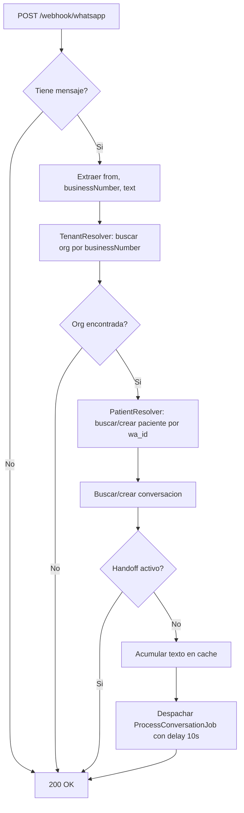

# Webhook de WhatsApp

## Endpoints

El sistema expone dos endpoints en `routes/api.php`:

| Metodo | Ruta | Controlador | Proposito |
|---|---|---|---|
| GET | `/webhook/whatsapp` | `verify()` | Verificacion del webhook por Meta |
| POST | `/webhook/whatsapp` | `handle()` | Recepcion de mensajes entrantes |

**Archivo:** `app/Http/Controllers/WhatsappWebhookController.php`

## Verificacion del webhook (GET)

Meta envia un GET para verificar que el endpoint es valido. El request incluye:

```
GET /webhook/whatsapp?hub.mode=subscribe&hub.verify_token=TU_TOKEN&hub.challenge=CHALLENGE_STRING
```

El controlador compara `hub.verify_token` con el valor configurado en `WABA_VERIFY_TOKEN`. Si coincide, devuelve el `hub.challenge`. Si no, devuelve 403.

**Nota:** Laravel puede recibir los parametros como `hub.verify_token` o `hub_verify_token` dependiendo de como los parsea. El controlador acepta ambos formatos.

## Recepcion de mensajes (POST)

### Payload de Meta

Meta envia un JSON con esta estructura (simplificada):

```json
{
  "entry": [{
    "changes": [{
      "value": {
        "metadata": {
          "display_phone_number": "+593XXXXXXXXX"
        },
        "messages": [{
          "from": "593XXXXXXXXX",
          "type": "text",
          "text": {
            "body": "Hola, quiero una cita"
          }
        }]
      }
    }]
  }]
}
```

### Flujo de procesamiento



### Detalles importantes

1. **Siempre devuelve 200:** Meta reintenta los webhooks que no devuelven 200. Incluso si hay un error interno, el controlador devuelve 200 para evitar retries infinitos.

2. **Contenido no textual:** Si el mensaje no es de texto (imagen, audio, sticker), se registra como `[Contenido no textual]`. El agente actualmente solo procesa texto.

3. **Debounce:** El mensaje no se procesa inmediatamente. Se acumula en cache y se despacha un job con delay de 10 segundos. Ver [debounce](../features/debounce.md).

4. **Handoff:** Si la conversacion tiene `handoff_to_human = true`, el mensaje se ignora silenciosamente. Ver [handoff](../features/handoff.md).

## Configuracion

Las variables de entorno relevantes estan en `config/services.php`:

```php
'waba' => [
    'token'        => env('WABA_TOKEN'),           // Token de acceso de Meta
    'phone_id'     => env('WABA_PHONE_ID'),        // Phone Number ID de la WABA
    'verify'       => env('WABA_VERIFY_TOKEN'),     // Token de verificacion del webhook
    'test_to'      => env('WABA_TEST_TO'),          // Numero de prueba (solo en local)
    'memory_limit' => env('WABA_MEMORY_LIMIT', 50), // Mensajes de historial enviados a Claude
],
```

## Seguridad

- El webhook no tiene autenticacion adicional mas alla del verify token de Meta
- No se almacenan tokens ni credenciales en el payload de la conversacion
- Los mensajes del paciente se almacenan en `conversation_messages` sin encriptar (consideracion para el futuro)
