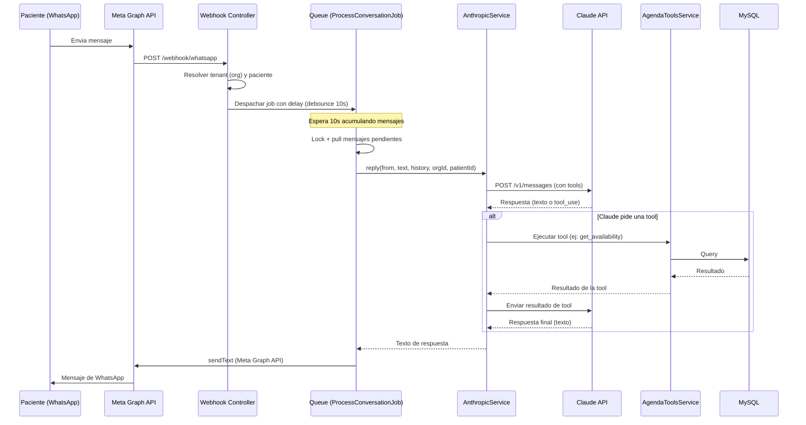

# Arquitectura del sistema

## Vision general

AgendAI sigue una arquitectura de **agente conversacional con tool calling**. El flujo es lineal: un paciente envia un mensaje por WhatsApp, el backend lo recibe, lo procesa con Claude (que puede llamar tools para consultar o modificar datos), y responde por WhatsApp.

No hay frontend involucrado en el flujo conversacional. La landing page (Inertia.js) es independiente.

## Diagrama de flujo principal



## Componentes principales

### Capa de entrada: Webhook

`WhatsappWebhookController` recibe webhooks de Meta, resuelve el tenant y el paciente, y despacha un job con delay para implementar debounce.

**Por que un job con delay?** Los pacientes de WhatsApp suelen enviar varios mensajes rapidos en secuencia ("hola" / "quiero una cita" / "para manana"). Sin debounce, cada mensaje generaria una llamada separada a Claude. El delay de 10 segundos agrupa estos mensajes en uno solo.

### Capa de procesamiento: AnthropicService

Es el cerebro del sistema. Recibe el texto del paciente mas el historial de conversacion, arma el system prompt, llama a Claude con las tool definitions, y ejecuta un **tool loop** de hasta 5 rondas.

**Por que un tool loop?** Claude puede necesitar llamar varias tools en secuencia para resolver una peticion. Por ejemplo: primero `get_professionals` para saber quien atiende, luego `get_availability` para ver horarios, y finalmente `confirm_appointment` para agendar.

### Capa de tools: AgendaToolsService

Ejecuta las operaciones reales contra la base de datos. Hay dos tipos de tools:

- **Read-only:** `get_services`, `get_professionals`, `get_availability`, `list_upcoming_appointments`
- **Transaccionales:** `confirm_appointment`, `cancel_appointment`, `reschedule_appointment`

Las tools transaccionales delegan en `AppointmentService` para la logica de negocio.

### Capa de salida: WhatsappService

Envia mensajes de texto al paciente via Meta Graph API. En entorno local/dev puede redirigir mensajes a un numero de prueba.

## Estructura de archivos

```
app/
  Http/Controllers/
    WhatsappWebhookController.php   # Webhook: recibe, resuelve, despacha job
  Jobs/
    ProcessConversationJob.php      # Debounce: lock, pull, llama AnthropicService
  Models/
    Organization.php                # Tenant
    Patient.php                     # Paciente (wa_id)
    Professional.php                # Profesional
    Service.php                     # Servicio
    Schedule.php                    # Horario semanal
    Appointment.php                 # Cita
    Conversation.php                # Conversacion activa
    ConversationMessage.php         # Mensajes individuales
    ToolCallLog.php                 # Log de tool calls
  Services/
    AnthropicService.php            # Claude API + tool loop
    AgendaToolsService.php          # Ejecutor de tools
    AppointmentService.php          # Logica transaccional de citas
    WhatsappService.php             # Envio de mensajes via Meta
    PatientResolverService.php      # Resuelve/crea paciente por wa_id
    TenantResolverService.php       # Resuelve org por numero WhatsApp Business
config/
  services.php                      # Configuracion de Anthropic, WABA
routes/
  api.php                           # POST|GET /webhook/whatsapp
database/
  seeders/DentalClinicSeeder.php    # Seed de prueba
```

## Decisiones arquitectonicas clave

### Por que tool calling nativo en vez de function calling simulado

Anthropic ofrece tool calling como ciudadano de primera clase en su API. Esto significa que Claude decide cuando llamar una tool, con que parametros, y puede encadenar multiples calls en una sola conversacion. No hay que parsear JSON de un string ni manejar errores de formato.

### Por que database driver para queue y cache

El sistema necesita que multiples procesos (web server y queue worker) compartan estado. El debounce depende de que el cache sea accesible desde ambos. Redis seria ideal en produccion, pero el driver `database` funciona sin dependencias adicionales y es suficiente para el volumen actual.

### Por que UTC en la base de datos

Todos los datetimes se almacenan en UTC. La conversion a hora local (America/Guayaquil, UTC-5) se hace en dos puntos:
1. Al recibir input del paciente (local a UTC)
2. Al presentar datos al paciente (UTC a local)

Esto evita problemas con cambios de zona horaria y simplifica queries de rango.

### Por que no hay flujo HOLD para citas

En el MVP se confirma la cita directamente sin pasar por un estado HOLD. El riesgo de doble booking es bajo en consultorios pequenos. La firma de `confirm_appointment` ya soporta agregar HOLD en el futuro sin romper el contrato.

## Observabilidad

Cada tool call se registra en `tool_call_logs` con:
- Nombre de la tool, input, resultado
- Duracion en milisegundos
- Si fue exitosa o no
- Mensaje de error si fallo

Ademas, los logs de la API van al channel `api` de Laravel para separar el ruido del log general.
