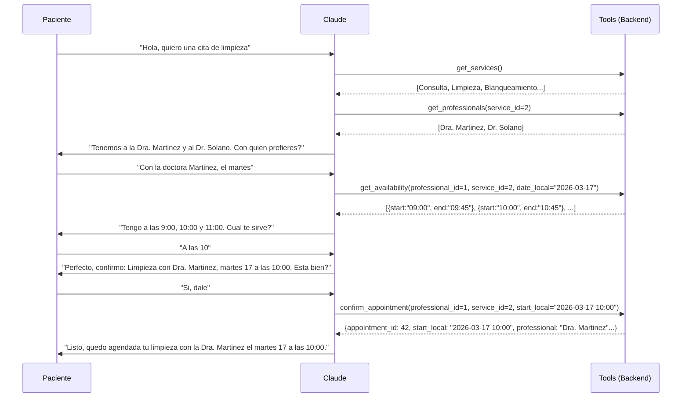
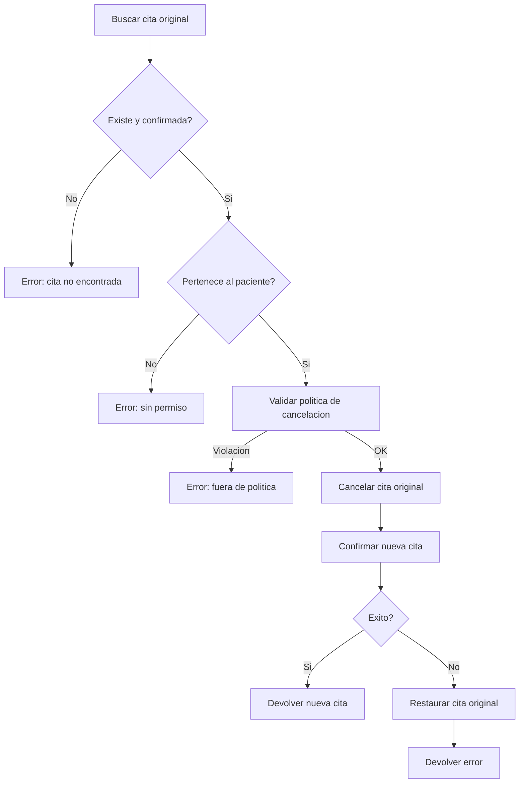

# Flujo de agendamiento de citas

## Vision general

El flujo completo desde que un paciente escribe hasta que tiene una cita confirmada involucra multiples tools y validaciones. Claude guia la conversacion, pero el backend es quien ejecuta cada operacion.

## Flujo tipico



## Confirmacion de cita

**Archivo:** `app/Services/AppointmentService.php` -- metodo `confirm()`

El flujo interno de `confirm_appointment`:

1. **Buscar organizacion** para obtener el timezone
2. **Convertir hora local a UTC** (`Y-m-d H:i` en zona Ecuador a UTC)
3. **Validar conflictos** -- verificar que no exista otra cita confirmada para el mismo profesional en el mismo horario
4. **Obtener duracion** desde la tabla pivot `professional_service`
5. **Crear la cita** con status `confirmed`
6. **Devolver resumen** con ID, hora local, profesional y servicio

### Validacion de conflictos

La validacion actual compara `start_at` exacto. Esto funciona para slots discretos pero no detecta solapamientos parciales. Es una simplificacion del MVP que se puede mejorar en el futuro.

## Cancelacion de cita

**Metodo:** `AppointmentService::cancel()`

1. **Buscar la cita** y verificar que exista y este confirmada
2. **Validar pertenencia** -- el `patient_id` debe coincidir
3. **Aplicar politica de cancelacion** -- verificar que falten al menos `cancellation_hours_min` horas
4. **Bypass por deposito** -- si `deposit_paid = true`, se omite la validacion de tiempo
5. **Cancelar** -- cambiar status a `cancelled` y registrar la razon

Ver [politica de cancelacion](cancellation-policy.md).

## Reprogramacion de cita

**Metodo:** `AppointmentService::reschedule()`

Reprogramar es una operacion compuesta con rollback manual:



**Por que rollback manual?** Se cancela la cita vieja antes de intentar la nueva. Si la nueva falla (slot no disponible), se restaura la original. Esto es mas claro que una transaccion de BD porque hay logica de negocio intermedia.

El campo `deposit_paid` se hereda de la cita original. Si la cita vieja tenia deposito, la nueva tambien lo tendra.

## Calculo de disponibilidad

**Metodo:** `AgendaToolsService::getAvailability()`

1. Determinar el dia de la semana para la fecha solicitada
2. Buscar los bloques horarios del profesional para ese dia (tabla `schedules`)
3. Obtener la duracion del servicio desde `professional_service.duration_minutes`
4. Generar slots contiguos dentro de cada bloque
5. Filtrar los que colisionan con citas existentes (status != cancelled)

**Ejemplo:** Si el profesional trabaja de 9:00 a 13:00 y el servicio dura 45 minutos:

```
Slots generados: 9:00-9:45, 9:45-10:30, 10:30-11:15, 11:15-12:00, 12:00-12:45
Si 10:30-11:15 esta ocupado: se elimina de la lista
```

## Casos especiales

### Multiples servicios en una cita

Si el paciente pide "limpieza y blanqueamiento", Claude esta instruido para asumir que todo va en la misma cita. Para la duracion, usa el servicio que dure mas (no suma duraciones). Esto es una simplificacion del MVP.

### Paciente nuevo

Si el paciente nunca ha interactuado, `PatientResolverService` lo crea automaticamente con datos minimos (`wa_id` y `phone_number`). El nombre se puede actualizar despues.

### Sin disponibilidad

Si `get_availability` devuelve un array vacio, Claude esta instruido para proponer 2-3 fechas alternativas cercanas en vez de simplemente decir "no hay disponibilidad".
