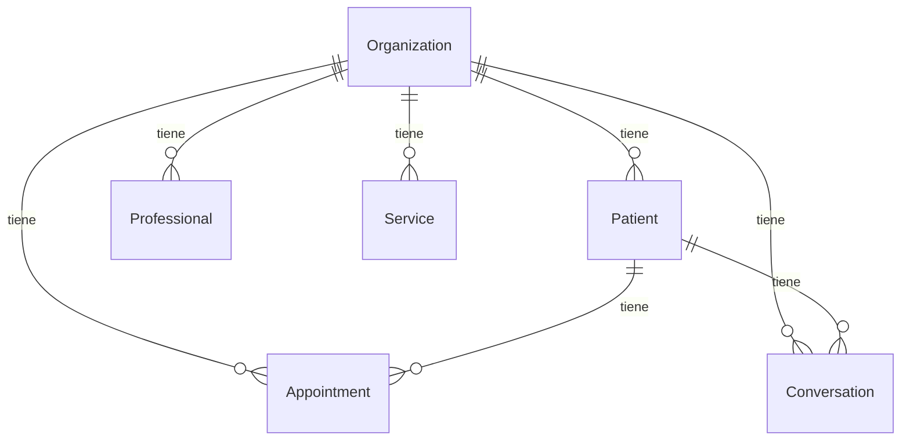

# Multi-tenancy

## Como funciona

AgendAI es multi-tenant: un mismo backend sirve a multiples consultorios. Cada consultorio es una **organizacion** (tenant) identificada por su numero de WhatsApp Business.

## Resolucion del tenant

Cuando llega un webhook de WhatsApp, el payload incluye el `display_phone_number` del numero Business que recibio el mensaje. `TenantResolverService` busca la organizacion correspondiente:

```php
Organization::where('wa_phone_number', $waBusinessNumber)->first();
```

Si no se encuentra la organizacion, el mensaje se ignora silenciosamente (se devuelve 200 OK a Meta pero no se procesa).

**Archivo:** `app/Services/TenantResolverService.php`

## Alcance del tenant

Una vez resuelta la organizacion, todos los datos se acotan a ese `org_id`:

| Entidad | Scoping |
|---|---|
| Pacientes | `patients.organization_id` |
| Profesionales | `professionals.organization_id` |
| Servicios | `services.organization_id` |
| Citas | `appointments.organization_id` |
| Conversaciones | `conversations.organization_id` |
| Tool call logs | `tool_call_logs.organization_id` |

Las tools del agente reciben el `org_id` como parte del contexto y filtran todas las queries por ese campo. Claude nunca ve datos de otra organizacion.

## Paciente dentro del tenant

Un paciente se identifica por la combinacion unica de `(organization_id, wa_id)`. Esto significa que un mismo numero de WhatsApp puede ser paciente en multiples consultorios, y cada uno tendra su propio registro, historial de conversacion y citas.

```php
Patient::firstOrCreate(
    ['organization_id' => $org->id, 'wa_id' => $waId],
    ['phone_number' => $waId]
);
```

**Archivo:** `app/Services/PatientResolverService.php`

## Configuracion por tenant

Cada organizacion tiene configuraciones propias:

| Campo | Descripcion | Default |
|---|---|---|
| `name` | Nombre del consultorio | -- |
| `wa_phone_number` | Numero de WhatsApp Business (identificador unico) | -- |
| `timezone` | Zona horaria | `America/Guayaquil` |
| `cancellation_hours_min` | Horas minimas para cancelar/reprogramar | 24 |

## Diagrama de relaciones



## Limitaciones actuales

- No hay panel admin para crear organizaciones -- se hace via seeder o directamente en la base de datos
- No hay aislamiento a nivel de base de datos (todas las orgs comparten las mismas tablas)
- No hay limites de uso por organizacion (rate limiting, cuota de mensajes, etc.)
- El timezone es configurable por org, pero actualmente solo se usa `America/Guayaquil`

Estas limitaciones estan previstas para resolverse en [Fase 3](../phases/phase-3.md).
